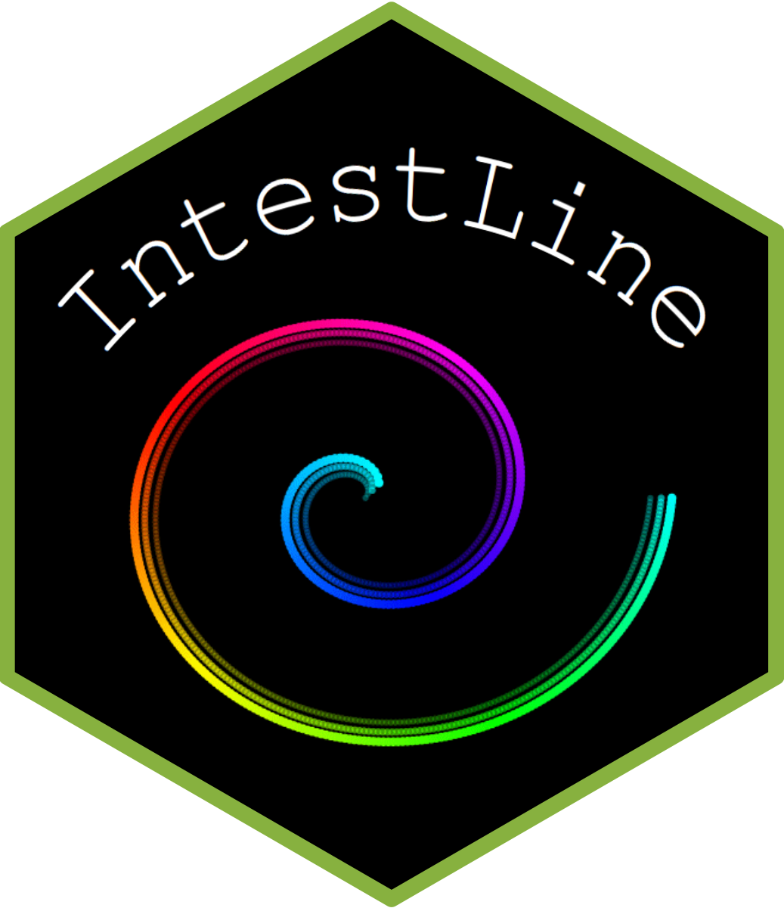

# IntestLine 

This package is aiming to unroll intestinal images from CODEX.\
This script is inspired by Parigi et al (https://www.nature.com/articles/s41467-022-28497-0). \
The method is implemented in a shiny-based web application: https://beta.fastgenomics.org/a/intestline

# User manual
Option 1: Use IntestLine application implemented in FASTGenomics\
[Step 1: Upload data](#step-1-Upload-data)\
[Step 2: Select backbone points](#step-2-Select-backbone-points)\
[Step 3: Unroll](#step-3-Unroll)\
[Step 4: Overlay parameters on the linear structure](#step-4-Overlay-parameters-on-the-linear-structure)\

Option 2: Use IntestLine locally

# Step 1: Upload data (Upper left panel in grey)
1. Go to website https://beta.fastgenomics.org/a/intestline To use the application, unfortunately you need to login with an account. You can register a your own account, but to test the application you can also use our IntestLine account (Username: intestline@gmail.com Password: intestline)
1.1 Upload CODEX-exported .csv file, containing x and y coordinates.\
1.2 If available, you can upload previously created backbone file.\
1.3 Select Region of Interest (ROI) by first choosing a center for the image.\
1.4 Then choose parameters a and b to highlight the elliptical area of interest.

# Step 2: Select backbone points (Upper right panel in blue)
2.1 Create a backbone by pressing with the mouse on the edge of the structures.\
2.2 **You must start from the center and go outward !**\
2.3 You can download the backbone selection for later use with the same ROI of the same image.\
2.4 You can preview the quality of the backbone selection. High quality backbone has a 3D spiral shape.

# Step 3: Unroll (Bottom panel in green)
3.1 Misprojected points can be filtered out by manipulating the angleCBS filter.\
3.2 Noisy points or contaminants can be eliminated by using the Z-score filtering.\
3.3 In both cases you can examine how many cells and from which regions are lost.

# Step 3.5: Overlay parameters on the linear structure
4.1 You can overlay expressed markers over the stretched image.\
4.2 This can be used to examine marker expression along the length and thickness of the organ.

# Cite us

